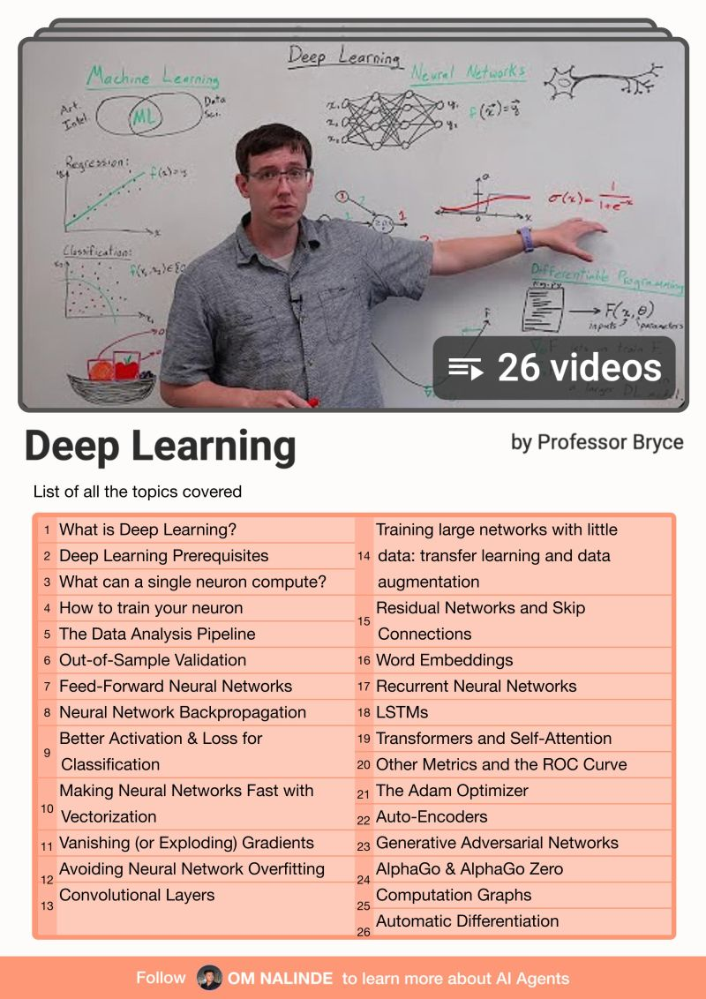

# Curated Links 

### Deep Learning Playlist by Prof. Bryce [Added on : 01/07/2025]
This curated [YouTube playlist](https://www.youtube.com/playlist?list=PLgPbN3w-ia_PeT1_c5jiLW3RJdR7853b9) by **Prof. Bryce** offers a comprehensive and accessible introduction to Deep Learning. It covers key concepts such as:

- Neural Networks and Backpropagation  
- Convolutional Neural Networks (CNNs)  
- Recurrent Neural Networks (RNNs)  
- Optimization techniques  
- Real-world deep learning applications  

Ideal for beginners and intermediate learners, the series combines intuitive explanations with mathematical rigor and practical examples.

➡️ **Watch the full playlist here**: [Prof. Bryce - Deep Learning Playlist](https://www.youtube.com/playlist?list=PLgPbN3w-ia_PeT1_c5jiLW3RJdR7853b9)

### Model Context Protocol (MCP) Server List [Added on : 01/07/2025]

An MCP server, or Model Context Protocol server, facilitates the standard communication between generative AI apps and the data they utilize, to simplify and accelerate the development of accurate and robust AI systems.The need for MCP servers arises from the challenges in managing massive volumes of data scattered across various sources. Enterprises often struggle with integrating and effectively using this data, especially when it's siloed in different systems. MCP servers provide an effective solution for ensuring that LLMs get the right data at the right time, reducing the chances of AI hallucinations and other errors.

[MCP Server Lists](./MCP-ServerLists.md)

Krish Naik Courses Link 

Generative AI and Agentic AI Courses
1. Complete Generative AI Course With Langchain and Huggingface
2. Complete Agentic AI Bootcamp With LangGraph and Langchain

Introduction to LLMs video by Andrej Karpathy : While not a traditional "course book," this is a 1-hour video that provides a high-level overview of the current state of generative AI, particularly Large Language Models (LLMs), setting the scene for understanding the industry. As a YouTube video, it is a free resource.

https://www.youtube.com/watch?v=zjkBMFhNj_g

Andrej Karpathy's Neural Networks: Zero to Hero course : This course teaches how to build PyTorch, or at least how it works under the hood, from scratch. It progresses from simple neural networks to building a GPT model using only raw NumPy arrays, meaning "no libraries". This course is typically available as a free video series.

https://www.youtube.com/playlist?list=PLAqhIrjkxbuWI23v9cThsA9GvCAUhRvKZ

Hands-on Large Language Models textbook by Jay Alammar

https://github.com/HandsOnLLM/Hands-On-Large-Language-Models

Important Link

[Introducing the Model Context Protocol](https://www.anthropic.com/news/model-context-protocol).

Blogs

[Build the GPT Tokenizer](https://www.fast.ai/posts/2025-10-16-karpathy-tokenizers)

Trainings  

[Associate AI Engineer for Developers](https://datacamp.pxf.io/kO2QWN)
[Large Language Model Agents](https://rdi.berkeley.edu/llm-agents/f24)
[Hugging Face Courses](https://huggingface.co/learn)
[Associate AI Engineer for Data Scientists](https://datacamp.pxf.io/DydA3n)
[Generative AI Engineering with LLMs Specialization](https://imp.i384100.net/WyQJNM)