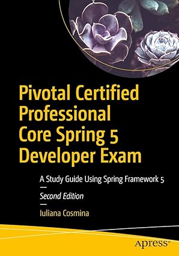

# Technical Book Notes Repository By Kaustav Das

Welcome to our repository of technical book summaries! Dive into a treasure trove of condensed knowledge where you'll discover insightful summaries of a wide array of technical books.

## Book Summaries

### Microservices Patterns With Examples In Java
- **Author:** Chris Richardson
- **Publication Date:** October 8, 2018
- **Tags:** Microservices, Java, Software Architecture
- **Summary:** Microservices Patterns teaches you how to develop and deploy production-quality microservices-based applications. This book helps you understand microservices architecture and gives practical advice and examples for implementing them in Java. It covers patterns for service decomposition, distributed data management, messaging, and more, making it an essential resource for anyone interested in building scalable and resilient microservices applications.
- **Note:** [MicroservicesPatternsWithExamplesInJava](#./MicroservicesPatternsWithExamplesInJava/MicroservicesPatternsWithExamplesInJava.pdf)

### Designing Data-Intensive Applications: The Big Ideas Behind Reliable, Scalable, and Maintainable Systems
- **Author:** Martin Kleppmann 
- **Publication Date:** March 16, 2017
- **Tags:** Data, Distributed Systems, Scalability, Reliability 
- **Summary:** Designing Data-Intensive Applications" provides a comprehensive overview of the principles, techniques, and patterns used in building data-intensive applications. Author Martin Kleppmann explores the fundamental concepts behind reliable, scalable, and maintainable systems, covering topics such as data models, storage engines, data processing, and distributed systems. Whether you're a software engineer, data architect, or tech enthusiast, this book offers invaluable insights into the intricacies of designing robust and efficient data-intensive applications.
- **Note:** [DesigningDataIntensiveApplications](#./DesigningDataIntensiveApplications\Designing-data-intensive-applications_Notes.pdf)

### Pivotal Certified Professional Core Spring 5 Developer Exam_2020

- **Author:** Iuliana Cosmina, Rob Harrop, Chris Schaefer, and Clarence Ho
- **Publication Date:** August 20, 2020
- **Tags:** Spring Framework, Certification, Java, Software Development
- **Summary:** The "Pivotal Certified Professional Core Spring 5 Developer Exam_2020" book is a comprehensive guide designed to help developers prepare for the Spring Professional Certification exam. Authored by seasoned professionals, this book covers key concepts, best practices, and advanced topics related to the Spring Framework version 5. It provides detailed explanations, practical examples, and sample questions to aid in understanding and mastering core Spring concepts. Whether you're aiming to become a certified Spring developer or seeking to deepen your knowledge of Spring framework, this book serves as an invaluable resource.
- **Note:** [Link to the folder in git repo](#)